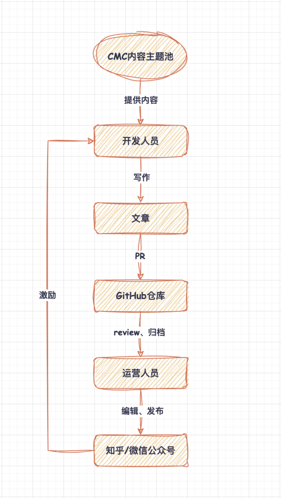
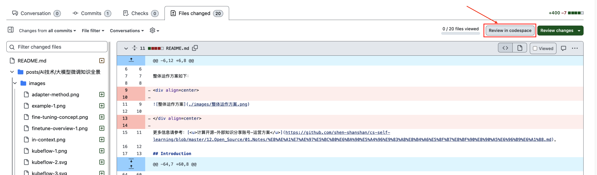
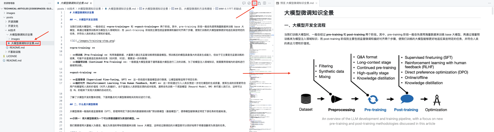
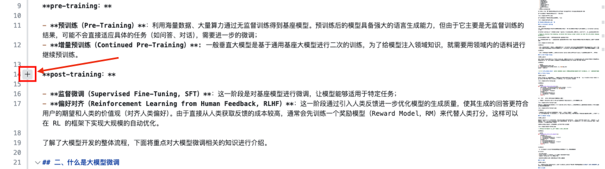

# technical-articles

## Overview

本仓库主要用于存档团队的技术博客，大家可以通过 PR 提交自己写的文章，通过 review 后由运营同学在知乎/微信公众号（开源时刻）上进行发表，对于高质量的文章会给予一定激励。

整体运作方案如下：

更多信息请参考：[<u>计算开源-外部知识分享账号-运营方案</u>](https://github.com/shen-shanshan/cs-self-learning/blob/master/12.Open_Source/01.Notes/%E8%AE%A1%E7%AE%97%E5%BC%80%E6%BA%90%E5%A4%96%E9%83%A8%E8%B4%A6%E5%8F%B7%E8%BF%90%E8%90%A5%E6%96%B9%E6%A1%88.md)。

## Introduction

### 内容来源

- 由 CMC 提供内容的来源和范围，形成内容主题池，每月发布当前的主题池，大家各自进行认领，认领之后一个月之内完成；
- 团队内的“天天向上”等分享会的内容可以作为技术分享类文章的内容来源；
- 大家手上已有的写的比较好的文章，可以拿出来先发起来。

### 写作规范

统一用 markdown 格式进行写作，每篇文章以标题名称创建一个文件夹，包含：`文章标题.md`、`images 文件夹`，图片统一用相对路径（`./iamges/xxx`）进行引用。

写作内容参考：

- [<u>美团外卖前端容器化演进实践</u>](https://mp.weixin.qq.com/s?__biz=MjM5NjQ5MTI5OA==&mid=2651751072&idx=1&sn=5b8d510f6b8ff2d06e8bc44606e12e00&chksm=bd125bed8a65d2fb8bcff8623a82fe06b667d2a75c5c6a32a2ce17d392d71dca97c973ed0aff&scene=21#wechat_redirect)
- [<u>大前端：如何突破动态化容器的天花板？</u>](https://mp.weixin.qq.com/s/ocGLvUmAnglZbcKRmK72Yg)
- [<u>作为开发者，我如何提高任务型大模型应用的响应性能</u>](https://mp.weixin.qq.com/s/_4s8HiRASW59V9S0YMRRww)
- [<u>HugeSCM - 基于云的下一代版本控制系统</u>](https://mp.weixin.qq.com/s/Q5pNC4N3Gh76LiJf-7cx7g)
- [<u>大模型加持下的Linux操作系统开发和自动化维护实践</u>](https://mp.weixin.qq.com/s/dlKd0Xzckk7Oy74dHiZFlQ)

写作格式参考：

- [<u>中文文案排版指北</u>](https://github.com/sparanoid/chinese-copywriting-guidelines)
- [<u>中文技术文档写作风格指南</u>](https://github.com/yikeke/zh-style-guide)

### 提交文章

通过 fork & PR 向该仓库提交文章进行投稿。

提交的文章按分类进行归档，提交到对应文件夹下，文章的类型包括：

- AI 技术
- IT 基础设施
- 开源文化
- 开源洞察

### 内容审核

提交的文章会有专人进行审核，并给出修改意见，完成修改后文章会转交给运营同学进行发布。

**Review 操作指导：**

由于在 GitHub 的 `Files changed` 页签中，无法直接预览 markdown 文件中的图片，不便于审核，因此可以通过使用 GitHub 提供的在线 codespace 进行 review。

在 PR 的 `Files changed` 页签中，点击右上角的 `Review in codespace`：

进入在线 vscode 后，在目录中单击打开需要 review 的文件，然后可以通过 `ctrl+shift+v`（Mac 是 `ctrl+cmd+v`）或点击右上角的按钮实现实时预览：

单击 markdown 文件左侧的 `+` 即可添加 review 意见：

### 文章发布

由运营同学（马铭新）进行发布。

### 创作激励

**_TODO_**

## Roadmap

| 内容主题 | 类别 | 备注 | 优先级 | 责任人 | 文章状态 | 发布日期 |
| :------ | :--- | :-- | :---- | :---- | :----- | ------- |
| **文章标题（示例）** | **AI 技术 / IT 基础设施 / 开源文化 / 开源洞察** | **文章摘要** | **低 / 中 / 高** | **姓名 工号** | **未认领 / 已认领 / 进行中 / 已提交 / 已发布** | **年-月-日** |
| 大模型微调知识全景 | AI 技术 | 大模型微调技术是指利用已经训练好的模型，针对特定的下游任务进行二次训练，从而能够满足多样化的业务需求，本文将对主流大模型微调技术的原理进行讲解。 | 高 | 申杉杉 00845128 | 已提交 | |
| …… | …… | …… | …… | …… | …… | …… |
